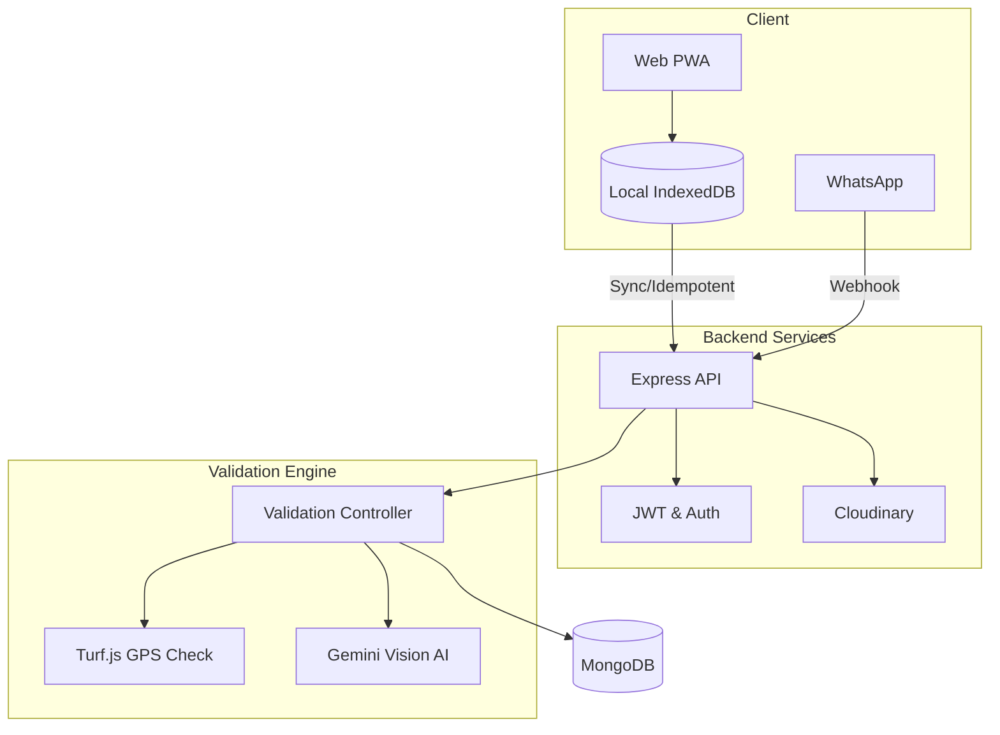

<div align="center">
  <h1>🌾 Smart e-Peek Pahani</h1>
  <p><strong>Secure, AI-assisted, Offline-first Digital Crop Survey Platform</strong></p>
  
  [](https://opensource.org/licenses/MIT)
  [](https://reactjs.org/)
  [](https://nodejs.org/)
  [](https://www.mongodb.com/)
  [](https://deepmind.google/technologies/gemini/)
  
  <br />
</div>

## 🎥 Demo Video

> **Watch the complete Round 2 demonstration:**  
> [👉 YOUR_DEMO_VIDEO_LINK_HERE](YOUR_DEMO_VIDEO_LINK_HERE)

---

## 🛑 1. The Problem
Traditional and field-level crop surveying in agriculture faces immense logistical and technical challenges:
- **Unreliable Connectivity:** Farms frequently lack stable internet, making real-time digital submissions impossible.
- **Location Spoofing:** It is difficult to verify whether a survey was genuinely captured at the correct land parcel (Gat) or faked off-site.
- **Manual Verification:** Human verification of millions of crop images is slow, expensive, and prone to error.
- **Data Integrity:** Poor networks often lead to duplicate submissions and unreliable synchronization.
- **Security Risks:** Unauthorized clients submitting arbitrary or malicious farmer/Gat information.
- **Accessibility:** Many farmers find web applications difficult to navigate and prefer familiar platforms like WhatsApp.

## 💡 2. Our Solution
**Smart e-Peek Pahani** is a comprehensive crop surveying ecosystem designed from the ground up to solve these specific agricultural field challenges. It seamlessly combines:

1. **GPS + Gat Geofencing** for dual-layer location verification
2. **Gemini Vision AI** for automated crop image analysis
3. **Offline-First PWA** for surveys in zero-connectivity areas
4. **WhatsApp Bot** for an accessible, low-friction farmer interface
5. **Secure Backend Validation** to guarantee data integrity

## 🎯 3. Why This Approach?
This architecture does not just digitize a paper process—it hardens it. By enforcing an **authoritative backend verification** (Turf.js) over UX pre-checks, ensuring **idempotent syncs**, and providing **AI-assisted reviews** instead of blind approvals, we've created a system that is robust against spoofing, network failures, and bad data.

---

## ✨ 4. Key Features

| Feature | Description |
|---|---|
| **Multi-Gat Architecture** | Farmers can manage multiple land parcels. Users must explicitly select the target Gat before submission. |
| **Dual-Layer GPS Verification** | Frontend UX geofencing pre-check (50m accuracy) + authoritative backend Turf.js validation. |
| **Gemini Vision AI** | Automated image verification to cross-check the declared crop against the uploaded photo. |
| **Offline-First PWA** | Built on Dexie/IndexedDB to cache submissions locally and automatically sync when online. |
| **Idempotent Sync** | Secure backend handles duplicate offline retries (HTTP 409) preventing duplicate records. |
| **WhatsApp Workflow** | Full survey flow directly inside WhatsApp with multi-language support. |
| **WebBridge** | Seamlessly connects a WhatsApp session to the rich web UI for complex status viewing. |
| **Reactive Dashboard** | Frontend UI instantly updates without refreshing via Dexie `useLiveQuery`. |

---

## 🌐 5. Complete Web Workflow

1. **OTP Login**: Farmer authenticates via mobile OTP.
2. **Gat Selection**: Farmer selects one of their associated land parcels.
3. **GPS Pre-Gate**: PWA captures device coordinates and checks if they fall within the Gat boundary (must have <50m accuracy).
4. **Survey Form**: Farmer declares the crop and uploads a live photo.
5. **Offline Queue**: If offline, the submission rests in the IndexedDB `SYNC_PENDING` queue.
6. **Background Sync**: Once online, the payload is securely transmitted.
7. **Reactive Update**: The local status changes to `SYNCED`, and the UI reacts immediately.

## 💬 6. WhatsApp Workflow

1. **Farmer Discovery**: System recognizes the phone number and loads the farmer profile.
2. **Language Selection**: Bot communicates in the farmer's preferred language (e.g., Marathi).
3. **Gat Selection**: Bot lists the farmer's associated Gats (1, 2, 3...) for explicit selection.
4. **Crop & Media**: Farmer replies with the crop name and a photo.
5. **Backend Processing**: Standard validation pipeline is triggered transparently.
6. **WebBridge**: Bot provides a secure one-time link to view the rich validation result on the web.

---

## 📍 7. GPS + Gat Verification
Our system uses a dual-layer location verification strategy to prevent spoofing:

1. **Frontend GPS Pre-Gate (UX)**
   - Acts as an early warning system.
   - Prevents the user from submitting if they are visibly outside the polygon or if GPS accuracy is worse than 50 meters.
   - UI Indicators: 🟢 *Location Verified*, 🔴 *Outside Selected Field*, 🟠 *GPS Accuracy Too Low*.
   
2. **Authoritative Backend Validation (Security)**
   - The frontend is **never** trusted as the final security boundary.
   - The backend runs `Turf.js` to mathematically guarantee the received coordinates fall within the farmer's authorized Gat polygon.

## 🤖 8. Gemini Vision AI
We utilize Google's **Gemini Vision AI** as a powerful crop verification layer.
- The AI analyzes the uploaded image and returns a `detectedCrop` and `confidence` score.
- The system compares the AI's detection against the farmer's `declaredCrop`.
- **Safe Failure Handling:** If Gemini fails, network errors occur, or confidence is too low, the system *never* blindly approves the crop. It securely degrades to a `REVIEW` status for manual administrative auditing.

## 📴 9. Offline-First Architecture & Synchronization
Designed for the field, the PWA relies on **Dexie (IndexedDB)**.
- Submissions made without internet are safely stored locally.
- The background `syncService` continuously monitors network status.
- When connectivity is restored, the queue is drained automatically.
- **Idempotency:** Every draft generates a stable `clientSubmissionId`. If a poor connection causes the client to retry a successful upload, the backend safely returns `HTTP 409 Duplicate`, and the frontend gracefully marks it `SYNCED` without creating duplicate database records.

## 🛡️ 10. Security Architecture
- **JWT Authentication:** Secures all backend web routes.
- **IDOR Protection:** Farmers can only submit data for Gats explicitly listed in their `associatedGats` array.
- **Backend Authority:** Location, crop matching, and authorization are evaluated exclusively on the server.
- **Secure WebBridge:** WhatsApp-to-Web transitions use single-use, verifiable tokens to prevent unauthorized viewing.

---

## 🏗️ 11. System Architecture Diagram



---

## 💻 12. Technology Stack

**Frontend:**
- React (Vite)
- Tailwind CSS
- Dexie (IndexedDB)
- React Leaflet (Mapping)
- PWA / Service Workers

**Backend:**
- Node.js & Express.js
- MongoDB & Mongoose
- JSON Web Tokens (JWT)
- Turf.js (Geospatial)
- Jest & Supertest (Testing)

**Cloud & Integrations:**
- Google Gemini Vision API
- Cloudinary (Media Storage)
- Twilio (WhatsApp API)

---

## 📁 13. Project Structure
*(Showing the primary active implementation folders)*

```text
Smart-E-Peek-Pahani/
├── frontend/                  # Active Web Frontend (PWA)
│   ├── src/
│   │   ├── components/        # Reusable UI elements
│   │   ├── pages/             # Route views (CropCapture, OfflineQueue)
│   │   ├── services/          # API & Background Sync logic
│   │   ├── storage/           # Dexie DB configuration
│   │   └── utils/             # GPS & Turf.js helpers
│   └── package.json
│
├── SKH/
│   └── backend/               # Active Node.js Backend
│       ├── src/
│       │   ├── controllers/   # Route handlers
│       │   ├── middleware/    # Auth & Error handling
│       │   ├── models/        # Mongoose schemas (Farmer, Gat, Submission)
│       │   ├── routes/        # Express routers
│       │   └── services/      # Validation Engine, AI, WhatsApp Flow
│       ├── tests/             # Jest automated test suites
│       ├── scripts/           # Demo seeding scripts
│       └── server.js
│
└── README.md
```
*(Note: Older backup folders like `frontend-old/` or `Member2-SKH/` may exist in the repository history but are not part of the active compilation path).*

---

## 🧪 14. Demo Scenarios & Dataset
The database includes a test farmer equipped with **five independent demo Gats**. 

**Demo Coordinates:**
- **Gat 101:** `19.901255644, 74.493974593`
- **Gat 102:** `19.878711131, 74.480893507`
- **Gat 103:** `19.900353351, 74.494841635`
- **Gat 104:** `19.900640864, 74.494954287`
- **Gat 105:** `19.901061250, 74.494914653`

**Test these scenarios:**
1. **Perfect Pass:** Select Gat 101 + Spoof GPS to 101's coords + Upload Soybean → `VALID`.
2. **GPS Failure:** Select Gat 101 + Spoof GPS to 102's coords → UI blocks submission (`🔴 Outside Selected Field`).
3. **Crop Mismatch:** Select Gat 101 + GPS 101 + Upload random object → `INVALID` (AI rejection).
4. **Offline Mode:** Turn off network → Submit → View in Offline Queue → Turn network on → Watch it auto-sync.
5. **WhatsApp Multi-Gat:** Message the bot from the demo number → See 5 Gats offered → Select Gat 2 → Complete flow.

---

## ⚙️ 15. Setup Instructions

### Prerequisites
- Node.js (v18+)
- MongoDB instance (Local or Atlas)
- Cloudinary Account
- Gemini API Key

### Backend Setup
```bash
cd SKH/backend
npm install

# Setup Environment Variables (Use .env.example as a template)
cp .env.example .env

# Start Development Server
npm run dev
```

### Frontend Setup
```bash
cd frontend
npm install

# Setup Environment Variables
cp .env.example .env

# Start Development Server
npm run dev
```

---

## 🔑 16. Environment Variables

**Backend (`SKH/backend/.env`)**
```env
PORT=5000
MONGODB_URI=your_mongo_connection_string
JWT_SECRET=your_secure_jwt_secret
FRONTEND_URL=http://localhost:5173

# Gemini Vision
GEMINI_API_KEY=your_gemini_key

# Cloudinary
CLOUDINARY_CLOUD_NAME=your_cloud_name
CLOUDINARY_API_KEY=your_cloudinary_key
CLOUDINARY_API_SECRET=your_cloudinary_secret

# Twilio WhatsApp (Optional for testing web-only)
TWILIO_ACCOUNT_SID=your_sid
TWILIO_AUTH_TOKEN=your_token
TWILIO_WHATSAPP_NUMBER=whatsapp:+1234567890
```

**Frontend (`frontend/.env`)**
```env
VITE_API_URL=http://localhost:5000/api
```

---

## 🩺 17. Automated Testing
The backend relies on a rigorous automated testing pipeline using Jest and Supertest. 

**Current Test Status:**
- **24 Test Suites Passed**
- **194 Tests Passed**
- **0 Failures**

Run tests locally:
```bash
cd SKH/backend
npm test
```

---

## 🚀 18. Future Scope
1. **Admin Dashboard Global Integration:** Current Admin UI is a local PWA offline-queue viewer. Next step is connecting it to a global `GET /api/submissions` MongoDB endpoint for true centralized auditing.
2. **Regional AI Models:** Fine-tuning Gemini models on localized, state-specific crop variants.
3. **Voice Surveying:** Completing the Marathi speech-to-text pipeline for fully hands-free farm surveying.

---

## 👥 19. Team
Built with ❤️ for the Smart e-Peek Pahani Hackathon.

---
<div align="center">
  <p><em>Empowering farmers with secure, reliable, and AI-driven agricultural tools.</em></p>
</div>
